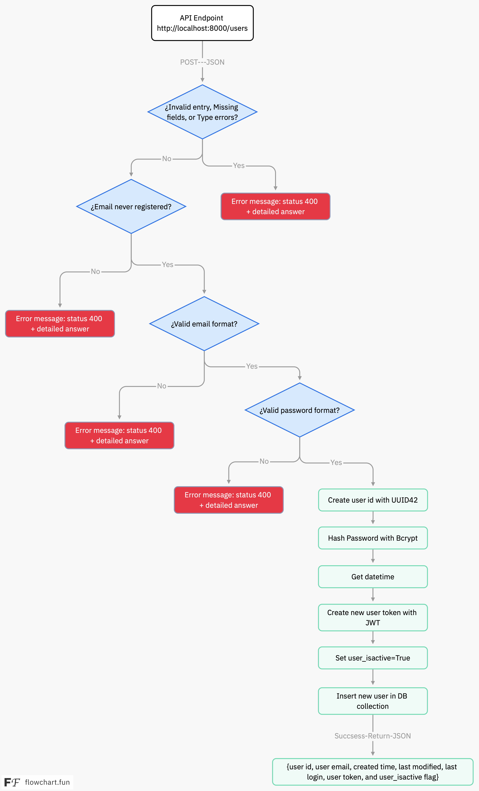

# Dev-Test-Minsal

This project is a RESTful API built with FastAPI for user registration. It includes features such as email and password validation, user creation, and token generation. The application is designed to work with a MongoDB database and can be containerized using Docker.

## Features

- **User Registration**: Allows users to register with a username, email, password, and phone numbers.
- **Validation**:
  - Email validation using regex.
  - Password validation to ensure it contains at least one uppercase letter, one lowercase letter, and two numbers, with no special characters.
- **Custom Exception Handling**: Provides detailed error messages for missing fields and type errors.
- **Password Hashing**: Uses bcrypt for secure password storage.
- **JWT Token Generation**: Generates a token for user authentication.

## Project Structure
.
Dev-Test-Minsal/
├── app/
│   ├── main.py
│   ├── models.py
│   ├── schemas.py
│   ├── database.py
│   ├── crud.py
│   └── validation.py
├── Dockerfile
├── docker-compose.yml
├── requirements.txt
└── Readme.md



## Requirements

- Python 3.9+
- MongoDB
- Docker

## Installation

1. Clone the repository:
    ```bash
    git clone https://github.com/dpasmino/Dev-Test-Minsal.git
    cd Dev-Test-Minsal
    ```

2. Run the project:
    ```bash
    docker-compose up --build
    ```

## Example Ideal Post Request
    ```JSON
    {
        "username": "username",
        "email": "aaaaa@domain.cl",
        "password": "Pass12",
        "phones":[
            {
                "number": "999999999",
                "citycode": "1",
                "countrycode": "57"
            }
        ]
    }
    ```
